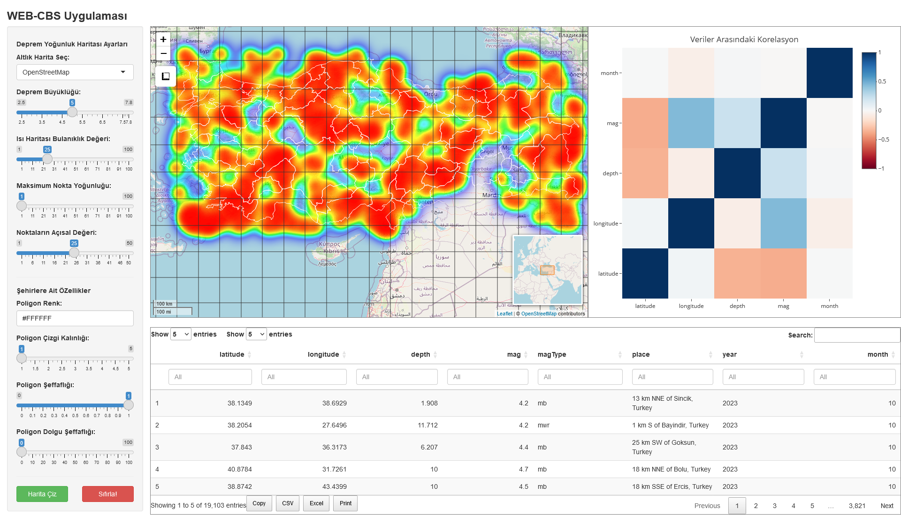

# Turkiye_Deprem_Analiz

### R Programlama dili kullanılarak geliştirilen WEB tabanlı CBS uygulaması. Uygulamada 1950 yılından itibaren Türkiye'de yaşanan depremlerin konumları kullanılarak yoğunluk haritası oluşturulmuştur. Harita uygulama içerisinde yer alan araçlar ile interaktif olarak değiştirilebilmektedir.

### Uygulamaya erişmek için https://efdalkaya.shinyapps.io/WEB-GIS/ 

